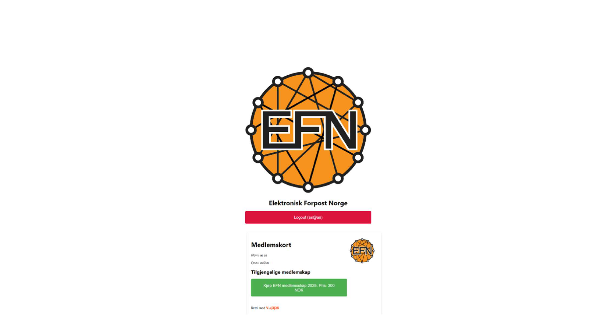
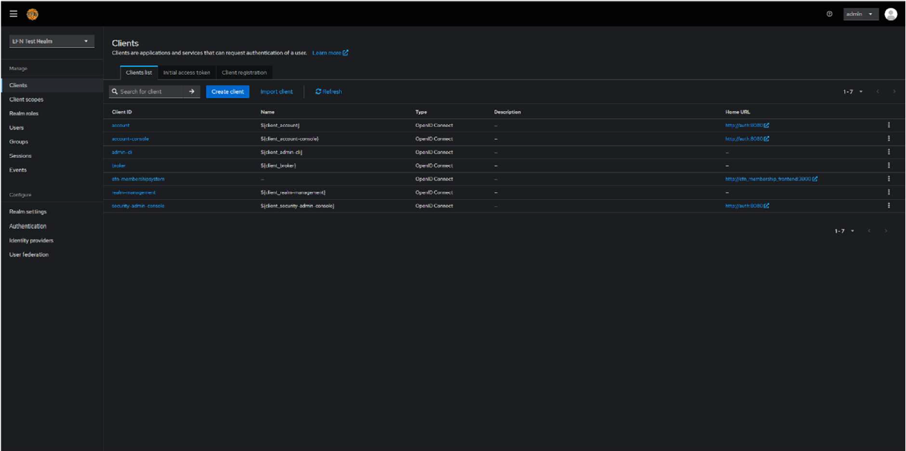
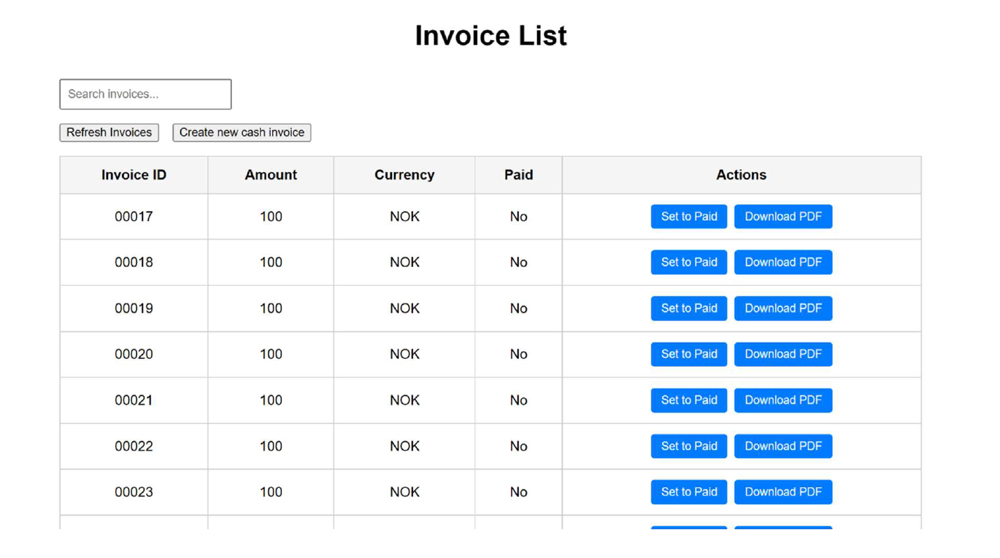

# Bachelorprosjekt: Medlemskap- og betalingssystem (EFN)

Dette repositoriet viser en anonymisert oversikt over bachelorprosjektet utviklet for organisasjonen EFN våren 2025. Systemet er utviklet for å forenkle håndtering av medlemskap, betaling og administrasjon.
> 📌 Prosjektet ble vurdert til karakter **A**.
> 
> 🛑 Merk: Kildekoden er konfidensiell og derfor ikke publisert.

## 📌 Oversikt over systemet

Systemet består av tre hoveddeler:
- **Frontend:** Bygget i React
- **Backend:** API utviklet i .NET (C#), integrert med Keycloak for autentisering
- **DevOps:** Docker-containere og Compose for lokal utvikling og test

### 📸 Skjermbilder
Under vises noen eksempler fra systemet:

| Medlemskort | Keyclaok | Betalingsoversikt|
|------------|------------------|------------------|
|  |  | 

### 📄 Bachelorrapport
Dette prosjektet ble vurdert til karakter **A**.  
PDF-versjon av bachelorrapporten kan lastes ned her:  
📄 [Last ned rapporten](rapport/EFN-Bachelorrapport.pdf)

## 🛠️ Teknologier brukt
- .NET 8 / C#
- React
- Keycloak (OIDC)
- Docker & Docker Compose
- PostgreSQL

## 👥 Gruppe
Prosjektet ble gjennomført som en gruppe bachelor i informasjonsteknologi ved OsloMet.
